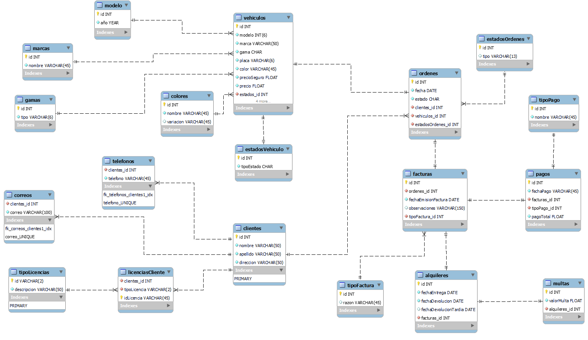

# ALQUILER DE AUTOS 

## MODELO CONCEPTUAL
El usuario podra realizar el alquiler de un vehiculo al llegar a las instalaciones, se podra registrar con anteriorirdad atraves de n formulario para estar en nuestra base de datos y agilizar el proceso de alquiler, podra filtrar los autos segun su gama, este mismo usuario podra rentar la cantidad de vehiculos que desee, hay vehiculos que poseen un seguro y este solo sera para vehiculos de gama media y alta, si el auto se renta a un amigo del dueño se puede omitir el cobro de este seguro, los alquileres se realizaran por dias, y si el usuario se pasa de los dias sera multado, el cliente al elegir el auto genera una orden la cual pasara a preparacion y sera entregado al cliente, esta orden tendra 2 estados, pendiente y completada, completada la orden se emitira una factura para que el usuario realice el pago del alquiler y pueda disfrutar de su auto.

Los valores de las multas seran definidos atraves de consultas, segun el porcentaje que el dueño desee.

Las multas se referenciaran junto con la factura inicial de alquiler. 

Tambien se debe manejar el estado fisico del vehiculo en un texto descriptivo de salida y un texto descriptivo de vuelta al lugar de rentado, llego el caso que hayan daños se emitira tambien una factura de cobro de loa arreglos del vehiculo si este es de gama baja, ya que no paga seguro.

## MODELO BASE DE DATOS

## DESCRIPCION DE LAS TABLAS

## Tabla estadosVehiculo
- `id` (INT): Identificador único.
- `tipoEstado` (CHAR, NOT NULL): Tipo de estado del vehículo.

## Tabla marcas
- `id` (INT): Identificador único.
- `nombre` (VARCHAR(45), NOT NULL): Nombre de la marca.

## Tabla gamas
- `id` (INT): Identificador único.
- `tipo` (VARCHAR(6), NOT NULL): Tipo de gama.

## Tabla colores
- `id` (INT): Identificador único.
- `nombre` (VARCHAR(45), NOT NULL): Nombre del color.
- `variacion` (VARCHAR(45), NULL): Variación del color (opcional).

## Tabla modelo
- `id` (INT): Identificador único.
- `anio` (YEAR, NOT NULL): Año del modelo.

## Tabla tipoLicencias
- `id` (VARCHAR(2)): Identificador único.
- `descripcion` (VARCHAR(50), NOT NULL): Descripción del tipo de licencia.

## Tabla clientes
- `id` (INT): Identificador único.
- `nombre` (VARCHAR(50), NOT NULL): Nombre del cliente.
- `apellido` (VARCHAR(50), NOT NULL): Apellido del cliente.
- `direccion` (VARCHAR(50), NOT NULL): Dirección del cliente.

## Tabla telefonos
- `clientes_id` (INT, NOT NULL): ID del cliente relacionado.
- `telefono` (VARCHAR(45), NOT NULL): Número de teléfono.

## Tabla correos
- `clientes_id` (INT, NOT NULL): ID del cliente relacionado.
- `correo` (VARCHAR(100), NOT NULL): Dirección de correo electrónico.

## Tabla licenciasCliente
- `clientes_id` (INT, NOT NULL): ID del cliente relacionado.
- `tipoLicencia` (VARCHAR(2), NOT NULL): Tipo de licencia.
- `idLicencia` (VARCHAR(45), NOT NULL): Identificador de la licencia.

## Tabla vehiculos
- `id` (INT): Identificador único.
- `modelo` (INT, NOT NULL): ID del modelo relacionado.
- `marca` (VARCHAR(50), NOT NULL): Marca del vehículo.
- `gama` (CHAR, NOT NULL): Gama del vehículo.
- `placa` (VARCHAR(6), NOT NULL): Número de placa.
- `color` (VARCHAR(45), NOT NULL): Color del vehículo.
- `precioSeguro` (FLOAT, NOT NULL): Precio del seguro.
- `precio` (FLOAT, NOT NULL): Precio del vehículo.
- `estados_id` (INT, NOT NULL): ID del estado del vehículo.
- `modelo_id` (INT, NOT NULL): ID del modelo relacionado.
- `marca_id` (INT, NOT NULL): ID de la marca relacionada.
- `gama_id` (INT, NOT NULL): ID de la gama relacionada.
- `colores_id` (INT, NOT NULL): ID del color relacionado.

## Tabla estadosOrdenes
- `id` (INT, NOT NULL): Identificador único.
- `tipo` (VARCHAR(13), NULL): Tipo de estado.

## Tabla ordenes
- `id` (INT): Identificador único.
- `fecha` (DATE, NOT NULL): Fecha de la orden.
- `estado` (CHAR, NOT NULL): Estado de la orden.
- `clientes_id` (INT, NOT NULL): ID del cliente asociado.
- `vehiculos_id` (INT, NOT NULL): ID del vehículo asociado.
- `estadosOrdenes_id` (INT, NOT NULL): ID del estado de la orden.

## Tabla tipoFactura
- `id` (INT, NOT NULL): Identificador único.
- `razon` (VARCHAR(45), NULL): Razón de la factura (opcional).

## Tabla facturas
- `id` (INT, NOT NULL): Identificador único.
- `ordenes_id` (INT, NOT NULL): ID de la orden asociada.
- `fechaEmisionFactura` (DATE, NOT NULL): Fecha de emisión de la factura.
- `observaciones` (VARCHAR(150), NULL): Observaciones sobre la factura (opcional).
- `tipoFactura_id` (INT, NOT NULL): ID del tipo de factura.

## Tabla tipoPago
- `id` (INT, NOT NULL): Identificador único.
- `nombre` (VARCHAR(45), NOT NULL): Nombre del tipo de pago.

## Tabla pagos
- `id` (INT, NOT NULL): Identificador único.
- `fechaPago` (VARCHAR(45), NOT NULL): Fecha del pago.
- `facturas_id` (INT, NOT NULL): ID de la factura asociada.
- `tipoPago_id` (INT, NOT NULL): ID del tipo de pago.
- `pagoTotal` (FLOAT, NOT NULL): Total del pago.

## Tabla alquileres
- `id` (INT, NOT NULL, AUTO_INCREMENT): Identificador único.
- `fechaEntrega` (DATE, NOT NULL): Fecha de entrega del vehículo.
- `fechaDevolucion` (DATE, NOT NULL): Fecha de devolución del vehículo.
- `fechaDevolucionTardia` (DATE, NULL): Fecha de devolución tardía del vehículo (opcional).
- `facturas_id` (INT, NOT NULL): ID de la factura asociada.

## Tabla multas
- `id` (INT, NOT NULL, AUTO_INCREMENT): Identificador único.
- `valorMulta` (FLOAT, NOT NULL): Valor de la multa.
- `alquileres_id` (INT, NOT NULL): ID del alquiler asociado.

Esta base de datos proporciona la estructura necesaria para administrar un sistema de alquiler de vehículos, incluyendo información sobre clientes, vehículos, órdenes, facturas, pagos, alquileres y multas.

## Requisitos del Software

### Requisitos Funcionales

1. **Registro de Usuarios**:
   - Los usuarios podrán registrarse a través de un formulario para agilizar el proceso de alquiler.
2. **Gestión de Vehículos**:
   - Los usuarios podrán consultar y filtrar los vehículos según su gama (baja, media, alta).
   - Los vehículos deben estar asociados a un estado físico inicial (salida) y un estado físico final (retorno).
3. **Alquiler de Vehículos**:
   - Los usuarios podrán rentar la cantidad de vehículos que deseen.
   - El sistema calculará automáticamente el costo del alquiler y, si corresponde, el costo del seguro.
   - En el caso de clientes relacionados (amigos del dueño), el seguro podrá ser exonerado.
   - Se registrará la duración del alquiler en días, y se calcularán multas en caso de retrasos.
4. **Gestión de Órdenes de Alquiler**:
   - Cada vez que un usuario selecciona un vehículo, se generará una orden con estado "pendiente" o "completada".
   - Una vez completada, se emitirá una factura con el monto a pagar.
5. **Cálculo de Multas**:
   - Las multas se calcularán según un porcentaje definido por el dueño.
   - Las multas serán incluidas en la factura del alquiler.
6. **Gestión de Daños a Vehículos**:
   - Si un vehículo de gama baja sufre daños, se emitirá una factura adicional para cubrir los costos de reparación.
7. **Facturación**:
   - El sistema generará facturas para el alquiler, incluyendo costos de seguro, multas y reparaciones, según corresponda.

### Requisitos No Funcionales

1. **Tecnología y Herramientas**:
   - El backend será desarrollado con **Spring Boot**.
   - El frontend se construirá utilizando **Bootstrap** para garantizar una interfaz responsive y moderna.
2. **Base de Datos**:
   - MySQL como sistema de gestión de base de datos para garantizar almacenamiento seguro y escalable.
3. **Rendimiento**:
   - El sistema debe procesar las órdenes de alquiler en menos de 2 segundos.
   - Soportar al menos 200 usuarios concurrentes sin degradar el rendimiento.
4. **Seguridad**:
   - Autenticación básica para el acceso de los usuarios.
   - Los datos sensibles del usuario serán almacenados de manera segura, cumpliendo estándares de encriptación.
5. **Mantenibilidad**:
   - Código modular para facilitar futuras actualizaciones.
   - Documentación completa del sistema (endpoints, procesos y configuración).
6. **Usabilidad**:
   - Interfaz amigable e intuitiva para el usuario, con mensajes de error claros.
   - Compatible con navegadores modernos y dispositivos móviles.
7. **Escalabilidad**:
   - El sistema debe ser escalable para soportar más usuarios, vehículos y funcionalidades en el futuro.

## WIREFRAME 

El wireframe fue diseñado con Excalidraw y puede revisarse [aqui](WireFrame_Alquiler.excalidraw)

## Construido con 🛠️

* [Notion](https://notion.so/es-es/product) - Para el diseño del modelo conceptual utilizamos notion 
* [Mysql Workbench](https://www.mysql.com/products/workbench/) - Para el diseño fisico
* [Typora](https://typora.io/) - Herramienta de construccion de Readme

